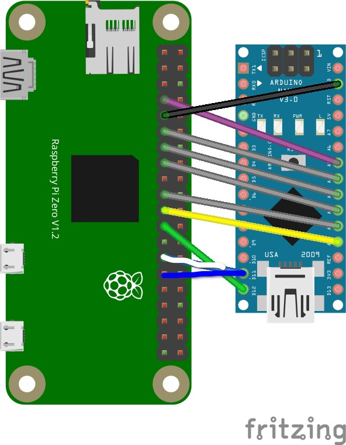

# FPV-Omnibot

[](https://www.youtube.com/watch?v=OyF7Ex0_O2U)

**Click the image above for a video demo ^^^. The .mp4 video is also in /media**

This a hack of the Crunch Labs Hack Pack Box #011 - Omnibot Forklift that unlocks its full potential and allows you do do fun things like:

- Add a 3D printed robotic gripper to pick things up
- Control the omnibot from a web dashboard on any device using the same network
- toggle a slow mode to enable precise maneuvering
- combine a camera with the web UI to add remote web streaming

To allow as many people as possible to upgrade their omnibots, I have added different configurations you can use:

- Slowmode (no extra hardware)
- Gripper (stock remote + gripper)
- Dashboard (stock omnibot + RPI)
- GripUI (gripper + RPI)
- FPV (RPI & camera, no gripper)
- LEGENDARY (gripper, RPI, & camera)

## Bill of Materials

1x Omnibot Forklift by Hack Pack

### Gripper

    1x MG90 or SG90 Servo
    4x M3x8 BHCS Screws
    2x M4x8 BHCS Screws
    2x M4x4x6 Heatset Inserts
    3x Male to Male Jumper wires
    3x Male to Female Jumper wires
    3D printed parts
    TPU filament or Grip Tape

### Web UI

    1x Raspberry Pi
    1x 5V battery pack & USB cable
    9x Female to Male Jumper wires

### Camera

    1x Raspberry Pi Camera 3 Wide
    1x 300mm
    4x M2x6 BHCS Screws
    4x M2 Nuts

## Instructions

### Gripper

Just put it together, it's pretty simple. Insert the heatsets, and the screw teh screws in. Also make sure you screw the base to the mount _before_ you attach the arms, or you'll have to redo them.

### RPI

First set up the RPI as normal with the Raspberry Pi Imager. I'd recommend using Raspberry Pi OS Lite (64-bit), but you can use whatever you'd like. Make sure to write down your hostname, username, and password. MAKE SURE to **connect your pi to WiFi** and **enable SSH with password authentication**.

When you're finished, insert the SD card into the RPI and power it up. Wait a minute or so, and then connect it by `ssh username@password` and enter your password. It should log in, and then run this command:

`wget https://github.com/HeavyFalcon678/FPV-Omnibot/raw/main/forky.sh && . forky.sh install && . forky.sh run`

finally, run `echo "$(hostname -I | awk '{print $1}'):5000"` and write down what it prints. This is the url your web interface will be running on. Then reboot the PI and you're good to go.

On the hardware side, wire it up like this:



All RPI pin names are in BCM

```
RPI <-> ARDUINO
GPIO4  - A5
GPIO17 - A4
GPIO27 - A3
GPIO22 - A2
GPIO10 - A1
GPIO9  - A0
GPIO11 - D12
GPIO5  - D11
GND - GND
```

And finally, upload `arduino_code/pi.ino` and `arduino_code/config.h` to the arduino using [Crunchlabs IDE](https://ide.crunchlabs.com/editor/omnibot-forklift/3/StockCode/StockCode.ino).

### Camera

Follow the instructions to setup the Raspberry Pi, and then connect the ribbon cable to the designated CSI connectors.

To mount the camera, print the `picamera3_mount.step` file and fix the camera onto the mount with the M2 nuts and bolts. You can add the mount to the top screw of the servo. The software is the same, `arduino_code/pi.ino`.

## Usage

### No RPI

UP + L -> Open Gripper
UP + R -> Close Gripper
DN + L -> Toggle Slow Mode

### With RPI

The UI is pretty straightforward, just go to port 5000 on the ip address of your pi and all the buttons are self explanatory. On desktop there are some keyboard shortcuts though:

```
W -> Up
S -> Down
A -> Left
D -> Right
Q -> Rotate CCW
E -> Rotate CW
W+A -> Diagonal Left Up
W+D -> Diagonal Right Up
S+A -> Diagonal Left Down
S+D -> Diagonal Right Down
SPACE -> Toggle Fast/Slow
I -> Raise Fork
K -> Lower Fork
J -> Open Gripper
L -> Close Gripper
```
